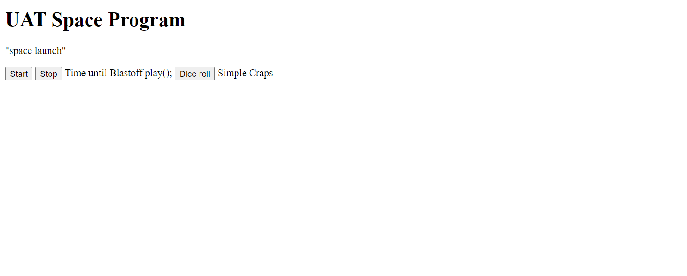

Objectives
Understand the role of JavaScript Functions
Write Functions
Comment Functions
Understand Inline JavaScript
Understand External JavaScript

# REQUIREMENTS

 >👨🏿‍⚖️ Click name to downlaod

[Visual Code](https://code.visualstudio.com/download)

# INSTALLATION

>👨🏿‍⚖️ INSTALL ZIP FILE OR CLONE REPO

[click here](https://github.com/brprod8/Building_Blocks) to clone repo

# LICENSE
**Open to Experiment**

BY:ROBERT SMITH

CREDIT: University of Advancing Tech

EMAIL - Buildingreality@skiff.com for Colloboration 